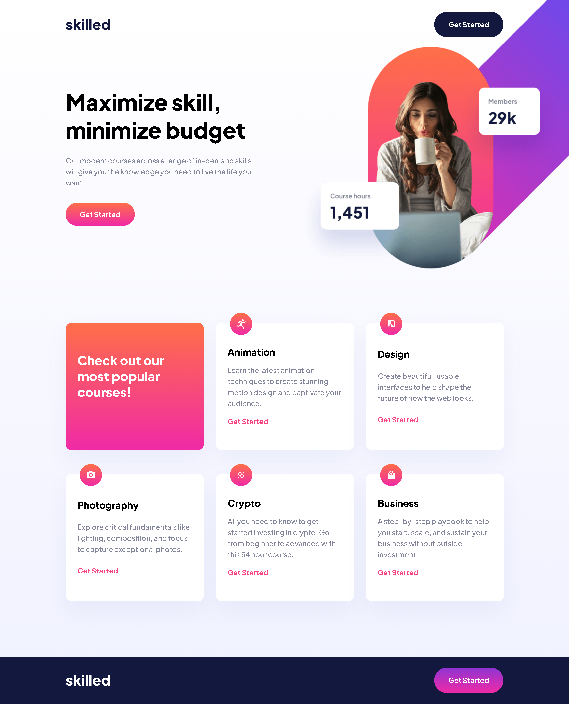

# Frontend Mentor - Skilled e-learning landing page solution

This is a solution to the [Skilled e-learning landing page challenge on Frontend Mentor](https://www.frontendmentor.io/challenges/skilled-elearning-landing-page-S1ObDrZ8q). Frontend Mentor challenges help you improve your coding skills by building realistic projects.

## Table of contents

- [Overview](#overview)
  - [The challenge](#the-challenge)
  - [Screenshot](#screenshot)
  - [Links](#links)
- [My process](#my-process)
  - [Built with](#built-with)
  - [What I learned](#what-i-learned)
  - [Useful resources](#useful-resources)
- [Author](#author)

### Screenshot

### Links

- Solution URL: [Frontend Mentor Solution]()
- Live Site URL: [Live Site at Github Page](https://rezcoco.github.io/skilled-elearning-landing-page)
## My process

### Built with

- Semantic HTML5 markup
- Flexbox
- Grid
- Responsive Design
- CSS Animations
- Media queries

### What I learned

I learned how to make responsive website, i struggled before doing this challenge. But now i feel learned a lot about responsive website

### Useful resources

- [Responsive Web Design W3 Schools](https://www.w3schools.com/html/html_responsive.asp) - Responsive Web Design W3 Schools

## Author
- Github - [rezcoco](https://github.com/rezcoco/)
- Frontend Mentor - [@rezcoco](https://www.frontendmentor.io/profile/rezcoco)
